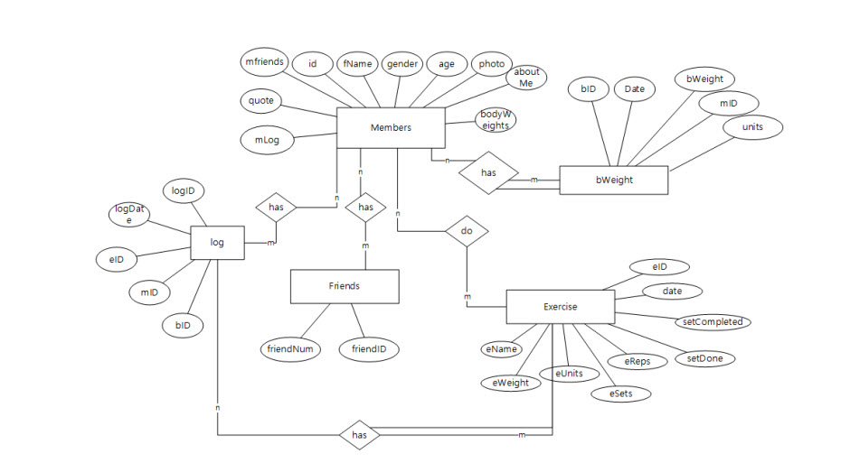
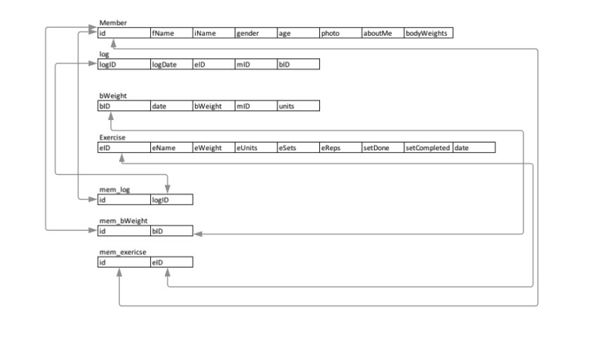
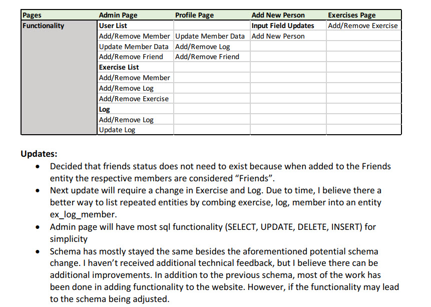

# Intro to Databases - Final Project

* **Technology used**: 
  * MySQL
  * Node.js
  * jQuery
  * JavaScript
  * Handlebars
* **Database:** 
  * Designed ERD and implemented schema 
  * Created SQL table creation, data dump, and data manipulation query code files

#### Entity-Relationship Diagrams and Schema

#### Website Page Outline

